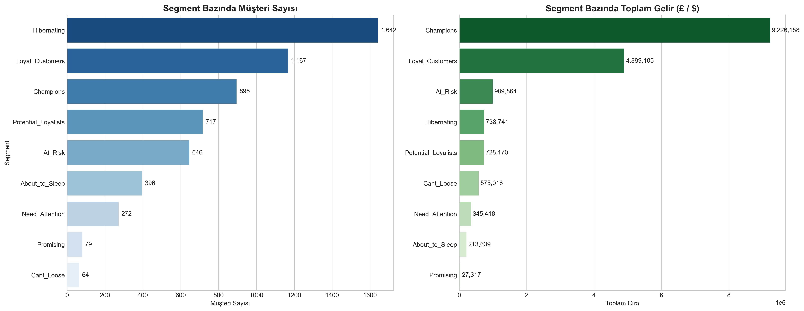
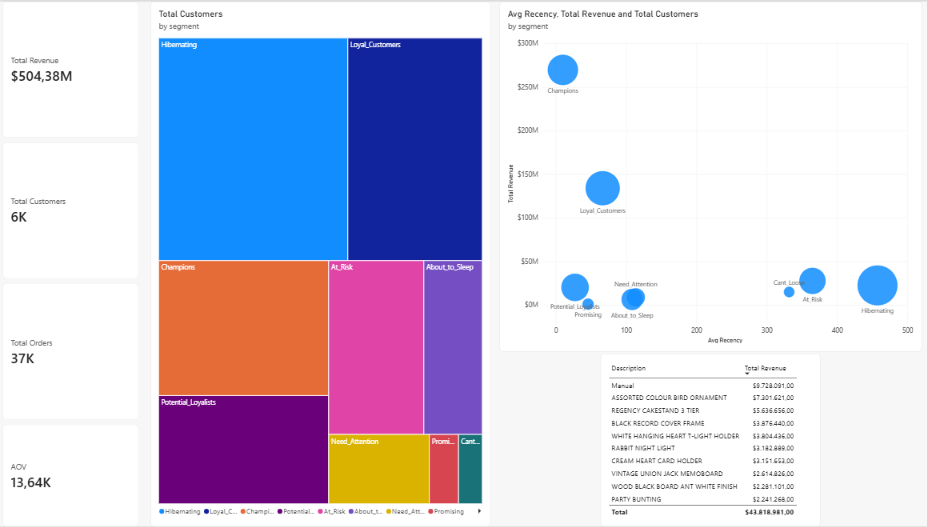

# 🛒 E-Ticaret Müşteri Segmentasyonu ve RFM Analizi (SQL + Power BI)

İşlem bazlı e-ticaret verileri üzerinde RFM (Recency, Frequency, Monetary) analizi uygulayarak yüksek değerli müşteri segmentlerini belirlemeyi ve müşteri kaybı (churn) riskini azaltmayı amaçlayan uçtan uca veri analitiği projesi.

---

## 📌 Yönetici Özeti
* **İncelenen Toplam İşlem:** 5.878 tekil müşteriye ait 805.549 temiz sipariş kaydı.
* **Temel Bulgular (Pareto Prensibi):** **Champions (Şampiyonlar)** segmenti müşteri tabanının yalnızca ~%15'ini oluşturmasına rağmen, toplam cironun **%53'ünden fazlasını ($269.7M / $504.4M)** tek başına üretmektedir.
* **Kayıp Riski:** **At Risk** ve **Can't Lose** segmentlerindeki yüksek harcama yapan müşteriler, hedefe yönelik geri kazanım kampanyalarıyla kurtarılabilecek ciddi bir gelir potansiyelini temsil etmektedir.

---

## 🛠️ Kullanılan Teknolojiler ve İş Akışı
* **SQL (DuckDB):** 
  * Veri temizleme (iptallerin, negatif/sıfır fiyatların ve eksik müşteri kimliklerinin ayıklanması).
  * Recency (gün farkı), Frequency (sipariş sayısı) ve Monetary (ciro) metriklerinin türetilmesi.
  * Pencere Fonksiyonları (**`NTILE(5)`**) ve CTE yapıları ile 1-5 arası skorlama.
* **Python (Pandas, Matplotlib, Seaborn):** Segment doğrulama, metrik dağılımları ve özet tablolar.
* **Power BI:** 
  * Yıldız şema (Star-schema) veri modelleme (Müşteri profilleri ve siparişler arasında 1-to-Many ilişki).
  * Dinamik DAX ölçüleri (`Total Revenue`, `AOV`, `Avg Recency`).
  * Çapraz filtrelemeli etkileşimli yönetim panosu.

---

## 📊 Görseller ve Pano

### 1. Python RFM Metrik Dağılımı
Segment bazında müşteri hacmi ve ciro dağılımı:

---

### 2. Etkileşimli Power BI Yönetim Panosu
Dinamik filtreleme ve segment bazlı ürün tercihleri panosu:

---

## 🎯 Stratejik İş Önerileri
* **Champions:** İndirim uygulanmamalı; VIP sadakat kulüpleri, yeni ürünlere erken erişim ve kişisel marka elçiliği teklif edilmeli.
* **Loyal Customers:** Sepet tutarını artırmak ve Champions segmentine geçişi sağlamak için çapraz satış ve paket ürün teklifleri sunulmalı.
* **At Risk & Can't Lose:** Acil müdahale grubu; otomatik geri kazanım e-postaları ("Sizi özledik"), kişiselleştirilmiş indirim kuponları ve memnuniyet anketleri devreye sokulmalı.
* **Hibernating:** Ücretli reklam bütçesi ayrılmamalı; yalnızca sıfır maliyetli bültenlerle iletişimde kalınmalı.